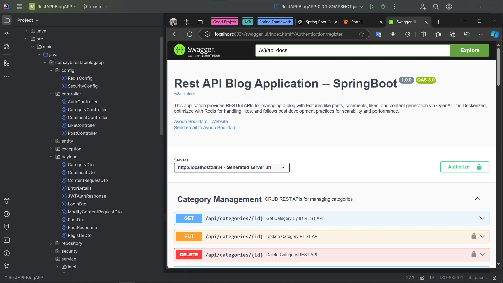
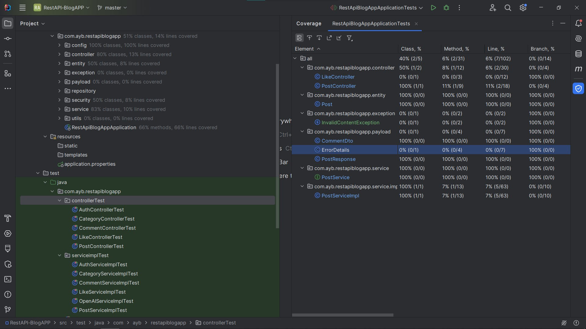

  # 🧠 ContentBot

**Timeline**: Sep 2024 – Oct 2024  
**Tech Stack**: Spring Boot · Java · Redis · PostgreSQL · Docker · OpenAI · JWT · Swagger · JUnit · Mockito  

## 🚀 Project Overview

ContentBot is a **scalable, intelligent blog platform** built with **Spring Boot**, designed to streamline the process of content creation and management.

The platform allows authenticated users to:
- ✍️ **Write and publish blogs** manually using a rich text editor.
- 🤖 **Generate blog content using OpenAI**, making it easy to brainstorm or create full articles with the help of artificial intelligence.
- 🛠️ **Edit existing blogs**, with the option to enhance or rewrite sections using AI assistance or manually.

---

## 🛠️ Key Features

- ✅ JWT-based authentication for secure user sessions  
- 🧠 OpenAI integration for AI-powered blog content generation  
- 🚀 Redis caching for optimized data retrieval  
- 📂 Full CRUD for blogs, categories, and users  
- 📚 Pagination and category filtering  
- 🧪 Unit & integration testing using JUnit and Mockito  
- 📑 Swagger for API documentation  
- 🧱 Built using SOLID principles and best practices  

---

## 🐳 Containerization & Deployment

- The application is fully **Dockerized**.
- **Docker Compose** is used to orchestrate:
  - `Redis` (caching)
  - `PostgreSQL` (database)
  - `Spring Boot API` service

You can pull the public Docker image here:  
👉 [Docker Hub - aybbm/restapi-blogapp-api_service](https://hub.docker.com/repository/docker/aybbm/restapi-blogapp-api_service/general)

---

## 📁 Project Structure

The project is organized following the **MVC architecture**.

---

## 📊 Test Coverage by Module

We ensured code reliability and test coverage using `JUnit` and `Mockito`. Below is an illustration of test coverage distribution across the application's modules.

---

## 📜 API Documentation

Interactive and user-friendly API documentation is provided via **Swagger**, making it easy to test and integrate endpoints.

---

## 📌 Skills & Concepts Used

- `Spring Boot` – Backend framework  
- `JWT` – Secure authentication  
- `Redis` – In-memory caching  
- `PostgreSQL` – Relational DB  
- `OpenAI API` – Content generation  
- `Docker & Docker Compose` – Containerization  
- `JUnit & Mockito` – Testing  
- `Swagger` – API documentation  
- `SOLID principles` – Clean code  
- `Exception Handling` – Robustness

---

> Feel free to clone, run, or extend ContentBot for educational or production use!

